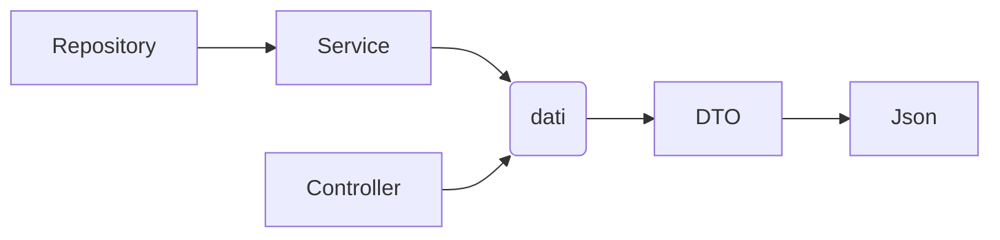

**Descrizione del Progetto di Tirocinio**

  

**Progetto Spring per gestione articoli cancelleria**

  
  

Il progetto usa Spring Boot 3.3.3, Maven per la gestione delle librerie, Java 21 e MariaDB 10.4 come database: gestisce un magazzino di articoli di cancelleria: posso inserire i vari

articoli e scegliere dove vengono inseriti nel magazzino, le quantità totali del prodotto e la categoria dell'articolo usando le end point esposte.

Ho realizzato delle pagine html/Jquery per provare la gestione dei dati altrimenti potrei usare un framework come Angular o React.

I test sono stati implementati con Junit.

Per installare il progetto si può clonare o scaricare da GitHub https://github.com/ManueldG2/Learning-Spring-Rest.git Eclipse si può importare come progetto Maven e avviare come

applicazione usando come classe principale LearningRestApplication partirà all'indirizzo http://localhost:8080 leggerà i dati da Mysql la porta di default 3306 la configurazione si

trova in src\main\resources\application.properties.

  
  

  
  

  
  

  
  

  
  

  
  

  
  

  
  

**Struttura**

**Tabelle:**

-   articolo (article)
    
-   categorie (category)
    
-   magazzino (fatta warehouse)
    

  
  

**Dipendenze:**

-   spring-boot-starter-web
    
-   mysql-connector-j
    
-   spring-boot-starter-data-jpa
    
-   spring-boot-starter-tomcat
    
-   spring-boot-starter-test
    
-   super-csv
    
-   opencsv
    
-   spring-boot-starter-tomcat
    
-   spring-boot-starter-validation
    
-   model mapper
    

  
  

  
  

  
  

**Endpoint article: (“http://localhost:8080/api/article”)**

-   ( GET ) /csv : crea un'esport in csv
    
-   ( GET ) / : restituisce lista articoli in json JOIN con category e warehouse
    
-   ( GET ) /{id} : restituisce l'articolo con id JOIN con category e warehouse
    
-   ( GET )/all : stampa a video lista articoli in json
    
-   ( GET ) /all/{id} : stampa a video articolo di id in json
    
-   (POST)add?title={string}&description={string}&characteristic={string}&category={string}&quantity={string}&unity={string}&code={string}&price={string} : aggiunge articolo usando le Query String
    
-   (POST) / : aggiunge articolo inviando un oggetto Json
    
-   aggiorna articolo:
    
    -   (PUT) /{id}: aggiornamento con json
        
    -   (POST)/update?title={string}&description={string}&characteristic={string}&category={string}&quantity={string}&unity={string}&code={string}&price={string}: aggiornamento tramite QueryString
        
-   (DELETE) /{id} : cancella elemento passando l’id
    

  
  

  
  

  
  

  
  

**Endpoint warehouse:** localhost:8080/api/warehouse

-   (GET) /: restituisce lista warehouse usando join article e category restituisce dati in json
    
-   (GET) /{id}: restituisce il warehouse con id usando join article e category restituisce dati in json
    
-   aggiunge warehouse:
    
    -   (POST) /: aggiunge articolo tramite invio dati in json
        
    -   (POST) /add?title={string}&description={string}&characteristic={string}&category={string}&quantity={string}&unity={string}&code={string}&price={string}:
        

aggiunge articolo tramite query string per usarlo con un form html

-   aggiorna Warehouse:
    
    -   (PUT) /{id} : aggiornamento con Json
        
    -   (POST) /update?title={string}&description={string}&characteristic={string}&category={string}&quantity={string}&unity={string}&code={string}&price={string}
        

aggiornamento query string

-   (DELETE) /{id} cancella elemento di id
    
-   (GET) /csv (get): crea un'esport in csv dei warehouse
    

  
  

  
  

  
  

  
  

**Procedimento**

Ho realizzato Entities articolo, warehouse e category con relative CRUD nei vari controller ho usato dei metodi di hibernate ma ho notato che non effettua una join ma due distinte select che poi unisce i valori in fase di output, quindi ho preferito creare delle procedure su Mysql che richiamo dal repository tramite il Bean @query che serve a inviare query Musql native. La validation usate per ora piuttosto semplice per evitare di inserire valori vuoti GlobalExceptionHandler mi aiuta a restituire il messaggio d'errore nel caso di valori fuori dalle regole stabilite.

infine ho terminato la realizzazione dei Junit test controllano le funzionalità le CRUD degli end point di Article, Category e Warehouse

  
  

**Eventuali funzionalità da implementare**

-   Report pdf
    
-   potrebbe essere utile fare un'autenticazione
    
-   Frontend React o Angular
    
-   Modificare ulteriormente l’output delle API sarebbe da rivedere la visualizzazione dei dati che in alcuni casi ho migliorato con l'uso dei DTO e query personalizzate per sfruttare le potenzialità della funzione join con le varie tabelle
    

**documentazione consultata**

-   https://stackoverflow.com/questions/48508285/how-to-handle-internal-server-error-500-on-spring-rest-api
    
-   https://salithachathuranga94.medium.com/validation-and-exception-handling-in-spring-boot-51597b580ffd
    
-   https://github.com/spring-guides/gs-validating-form-input/tree/main
    
-   https://journaldev.nyc3.cdn.digitaloceanspaces.com/spring/SpringFormValidation.zip
    

  

Descrizione del grafico: service estende repository controller richiama repository o service che uso per accedere al db e in genere struttura i dati in base al Dto
	

service estende repository
controller richiama repository o service che uso per accedere al db e in genere struttura i dati in base al Dto 
