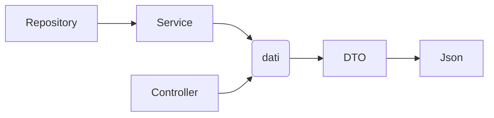

# Progetto Spring per gestione articoli cancelleria 

### Descrizione
Il progetto Maven usa Spring Boot 3.3.3 Java 21 e Mysql come database gestisce un magazzino di articoli di cancelleria: posso inserire i vari articoli scegliere dove vengono inseriti nel magazzino con le quantità totali del prodotto e la categoria dell'articolo usando le end point esposte.

Ho realizzato delle pagine html/Jquery temporanemente per provare la gestione dei dati altrimenti potrei usare un framework come Angular o React.  

per installare il progetto puoi clonarlo da https://github.com/ManueldG/learnig-rest.git (per ora privato) installare le dipendenze maven usando Eclipse basta avviare LearningRestApplication come Application usa l'indirizzo http://localhost:8080/ mentre mysql la porta di default 3306

### tabelle:
   - articolo (article)
   - categorie (category)
   - magazzino (fatta warehouse)
   
### dipendenze:
		
- spring-boot-starter-web
- mysql-connector-j
- spring-boot-starter-data-jpa
- spring-boot-starter-tomcat
- spring-boot-starter-test
- super-csv
- opencsv
- spring-boot-starter-tomcat
- spring-boot-starter-validation
- model mapper
		

### Endpoint article: 

   - `localhost:8080/api/article/csv` (get): crea un'esport in csv
   
   - `localhost:8080/api/article` (get): stampa a video lista articoli in json 
   
   - `localhost:8080/api/article/{id}` (get): stampa a video l'articolo con id 

   - `localhost:8080/api/article/all` (get): stampa a video lista articoli in json facendo una join sia con warehouse che con category
   
   - `localhost:8080/api/article/all/{id}` (get): stampa a video articolo di id in json facendo una join sia con warehouse che con category 
   
   - aggiunge articolo:
     - (post) con query string:  `localhost:8080/api/article/add?title={string}&description={string}&characteristic={string}&category={string}&quantity={string}&unity={string}&code={string}&price={string}`
     - (post) con json: `localhost:8080/api/article` passare oggetto Article

   - aggiorna articolo:
     - (put) aggiornamento con json: `localhost:8080/api/article/{id}` 
     - (post) aggiornamento query string: `localhost:8080/api/article/update?title={string}&description={string}&characteristic={string}&category={string}&quantity={string}&unity={string}&code={string}&price={string}`
   
   - `localhost:8080/api/article/{id}` (delete) -> cancella elemento di id

### Endpoint warehouse:
   

   - `localhost:8080/api/warehouse` (get): stampa a video lista warehouse usando join article e category restituisce dati in json

   - `localhost:8080/api/warehouse/{id}` (get): stampa a video il warehouse con id  usando join article e category restituisce dati in json

   - aggiunge warehouse:

     - (post) aggiunge articolo tramite invio dati in json: `localhost:8080/api/warehouse`

     - (post) aggiunge articolo tramite query string per usarlo con form html: `localhost:8080/api/warehouse/add?title={string}&description={string}&characteristic={string}&category={string}&quantity={string}&unity={string}&code={string}&price={string}`

   - aggiorna Warehouse:
     - `localhost:8080/api/warehouse/{id}` (put): aggiornamento con json

     -  (post) aggiornamento query string uso query string: `localhost:8080/api/warehouse/update?title={string}&description={string}&characteristic={string}&category={string}&quantity={string}&unity={string}&code={string}&price={string}`

   
   - `localhost:8080/api/{id}` (delete) -> cancella elemento di id

   - `localhost:8080/api/warehouse/csv` (get): crea un'esport in csv dei warehouse

## Endpoint di test 
  - `localhost:8080/api/article/hello` (get): restiruisce Hello World con http http status ok

  - `localhost:8080/api/article/query?id={string}` (get): restiruisce la stampa del valore id

### Procedimento

Ho realizzato entities articolo, warehouse e category con relative CRUD nei vari controller 
ho usato dei metodi di  hibernate ma ho notato che non effettua una join ma due distint select che poi unisce quindi ho preferito creare delle procedure su mysql che richiamo dal repository tramite le query native @query all'interno di delle repository.
La validation per ora piuttosto semplice per evitare di inserire valori vuoti tramite GlobalExceptionHandler mi aiuta a restituire il messaggio d'errore nel caso di valori fuori dalle regole stabilite all'interno delle entities 
infine ho terminato la realizzazione dei Junit test controllano le CRUD degli end point di Article, Category e Warehouse

#### in esecuzione 
 - forse da rivedere la visulizzazione dei dati che in alcuni casi ho migliorato con l'uso dei DTO e query personalizzate per sfruttare le potenzialità della funzione join con le varie tabelle
 
#### da fare
 - pdf
 - potrebbe essere utile fare un'autenticazione 

### documentazione consultata
 - `https://stackoverflow.com/questions/48508285/how-to-handle-internal-server-error-500-on-spring-rest-api`
 - `https://salithachathuranga94.medium.com/validation-and-exception-handling-in-spring-boot-51597b580ffd`
 - `https://github.com/spring-guides/gs-validating-form-input/tree/main`
 - `https://journaldev.nyc3.cdn.digitaloceanspaces.com/spring/SpringFormValidation.zip`
 
### strumenti utili
 - https://purecode.ai
 - https://mui.com/

endpoint get:
- La classe Article esegue una join con WhareHouse e Category e restituisce i dati
- la classe Warehouse con Article e quindi category 
- mentre category restituisce solo i dati ricevuti da una semplice select

service estende repository
controller richiama repository o service che uso per accedere al db e in genere struttura i dati in base al Dto 
